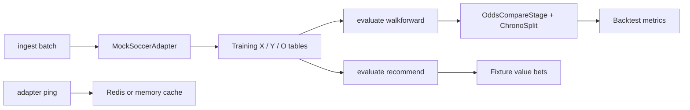

# Sports Betting Insight Pipeline (BIP)

Stage-based TypeScript pipeline for soccer betting research — ingest historical data, run walk-forward backtests, and surface value-bet recommendations. Uses adapter/stage vocabulary instead of traditional dataloader/bettor naming.

## Features

- **Ingest stage** — extract training matrices and upcoming fixtures from mock or live soccer CSV adapters
- **Evaluate stage** — odds-comparison value detection with chronological walk-forward backtests
- **Adapter layer** — Redis-backed cache with automatic in-memory fallback
- **Classifier stage** — optional ML-based betting stage (`ClassifierStage`)
- **CLI flow runner** — `ingest` / `evaluate` / `adapter` command groups

## Quick start

**Requirements:** Node.js 20+, `OPENAI_API_KEY` in `.env`

```bash
npm install
cp .env.example .env   # add OPENAI_API_KEY
npm run flow -- evaluate matchup --home Arsenal --away Chelsea
```

Pipeline stages: **team intel → baseline → LLM outcome** (use `--no-ai` for baseline only).

## Architecture

```
betting-insight-pipeline/
├── cmd/flow.ts                 CLI orchestrator (ingest → evaluate → adapter)
├── contracts/tables.ts         Table, TrainData, ParamGrid type contracts
├── shared/                     Frame utils, validators, edge math, ChronoSplit
├── adapters/
│   ├── data/                   BaseDataAdapter, MockSoccerAdapter, LiveSoccerAdapter
│   └── cache/                  Redis adapter, memory store, cache key builder
├── stages/betting/             BaseBettingStage, OddsCompareStage, runBacktestStage
├── pipeline/index.ts           Public library exports
└── test/suite/                 Vitest unit tests
```

### Data flow



## CLI reference

| Command | Description |
|---------|-------------|
| `ingest manifest` | List allowed parameter grid combinations |
| `ingest sources` | List available bookmaker odds column prefixes |
| `ingest batch [--out dir] [--no-cache]` | Extract training data; optionally write CSVs to `--out` |
| `evaluate walkforward [--out dir] [--no-cache]` | Time-series backtest with 2 splits; optional JSON output |
| `evaluate recommend [--no-cache]` | Fit on history, predict value bets on upcoming fixtures |
| `adapter ping` | Test Redis connectivity (warns if disabled) |
| `adapter purge` | Flush all keys under the `bip:` cache prefix |

### Examples

```bash
# List training parameter combinations
npm run flow -- ingest manifest

# Export training CSVs
npm run flow -- ingest batch --out ./exports

# Run backtest and save results
npm run flow -- evaluate walkforward --out ./results

# Find value bets on fixtures (skip cache)
npm run flow -- evaluate recommend --no-cache

# Verify Redis
npm run flow -- adapter ping
```

## Library API

```typescript
import {
  MockSoccerAdapter,
  OddsCompareStage,
  runBacktestStage,
  ChronoSplit,
  isValueBet,
  impliedProbability,
} from "./pipeline/index.js";

const adapter = new MockSoccerAdapter();
const [X, Y, O] = adapter.extractTrainData(0, "williamhill");

const stage = new OddsCompareStage(["williamhill"], 0.03);
stage.fit(X, Y);

if (O) {
  const results = runBacktestStage(stage, X, Y, O, new ChronoSplit(2));
  console.log(results);
}
```

## Environment variables

Copy `.env.example` to `.env`:

| Variable | Default | Description |
|----------|---------|-------------|
| `REDIS_URL` | — | Full Redis connection URL |
| `REDIS_HOST` | `127.0.0.1` | Redis host (used when `REDIS_URL` unset) |
| `REDIS_PORT` | `6379` | Redis port |
| `REDIS_ENABLED` | `true` | Set `false` to force in-memory cache only |
| `REDIS_KEY_PREFIX` | `bip:` | Namespace prefix for all cache keys |
| `REDIS_CACHE_TTL_SEC` | `3600` | Default TTL for cached backtest/value-bet results |

## Scripts

| Script | Description |
|--------|-------------|
| `npm run flow` | Run the CLI flow runner |
| `npm run typecheck` | TypeScript strict check |
| `npm run build` | Compile library to `dist-lib/` |
| `npm test` | Run Vitest suite (`test/suite/`) |
| `npm run test:watch` | Vitest watch mode |

## Key types

| Type | Location | Role |
|------|----------|------|
| `MockSoccerAdapter` | `adapters/data/mockSoccerAdapter.ts` | In-memory sample league data |
| `LiveSoccerAdapter` | `adapters/data/liveSoccerAdapter.ts` | Remote GitHub CSV with cache |
| `OddsCompareStage` | `stages/betting/oddsCompareStage.ts` | Implied-prob edge vs market odds |
| `runBacktestStage` | `stages/betting/backtestStage.ts` | Walk-forward ROI/yield metrics |
| `ChronoSplit` | `shared/chronoSplit.ts` | Time-ordered CV splitter |

## Further reading

- `runbooks/ingest-evaluate.md` — ingest → evaluate workflow
- `CONTRIBUTING.md` — development guidelines

## Contact
Telegram: https://t.me/snipmaxi
